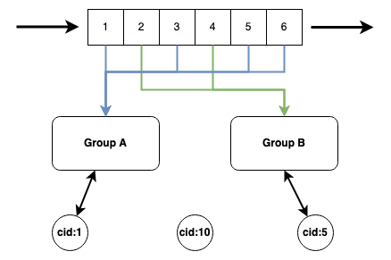

# JetStream Ordered Consumer Groups

|Metadata|Value|
|--------|-----|
|Date    |2021-08-03|
|Author  |@ripienaar|
|Status  |Approved|
|Tags    |server, client|

## Status

At this point the ADR is only focussing on capturing the problem, not suggesting solutions, the problem is stated in terms
of JetStream but there may well be a Core NATS solution that play into this, this document is a starting point for a discussion.

## Context

Strictly ordered consumption from a Stream requires a Max Ack Outstanding of 1, this ensures that messages are fully processed
to completion in Stream order.

This has severe implications for scaling - with only 1 message in flight ever it means it's impossible to effectively scale out
consumption of messages.

For many kinds of data what is actually needed is not a Stream level ordered consumption but ordered consumption of a subset of
messages.

Consider messages from millions of sensors:

|Seq|Subject|Message|Group|
|---|-------|-------|--------|
|1  |sensor.1.temp|28.1|A|
|2  |sensor.2.temp|20|B|
|3  |sensor.1.humidity|60|A|
|4  |sensor.2.humidity|55|B|
|5  |sensor.3.temp|30|A|
|6  |sensor.3.humidity|70|A|

When doing summarization of these metrics 2 consumers could be created, and consuming messages in parallel, as long as 
all the messages for a given sensor always goes to the same consumer. Each of the consumers could have a Max Ack Outstanding
of 1 meaning the messages are strictly ordered within the sensors assigned to the group.

This results in 2 messages being in-flight at any given time and ordering, where it matters, being maintained. With an intelligent
way of mapping sensor data to a particular group additional sensors will automatically result in a particular sensor entering a 
group - sensor 4 would join group `B` perhaps.

As shown here we should support a standby consumer (`cid:10` here) that will step in anywhere a active consumer fails.

The solution we design has to consider a number of issues discussed below.

### Group allocation

Messages are placed in groups dynamically based on a property in the message. In our case we might require a header
to be set for example `NATS-Consumer-ID: 1` for sensor 1. If a stream is then configured to maintain 5 consumer groups
dynamically we would run id `1` through an algorithm that places this messages into one of 5 groups. The algorithm has
to be such that every message for `NATS-Consumer-ID: 1` will always be placed in the same group.

In practise this might not be enough as one can imagine that there could be a group interested in processing all 
`sensor` (here `temp` or `humidity`) as the group key so we should consider alternate approaches. Initially we probably 
need to avoid supporting looking into the data - later a WASM binary can be ran in a stream to calculate the group based on
content.

There are several considerations for scaling up and down discussed later.

### Failover Consumer

In the diagram we have a client `cid:10` that is not consuming from any group, the purpose of this is to demonstrate that
a stand-by client should be possible and that it should take over from the main client should it terminates.

It would be acceptable if this client was designated stand-by for only a particular group, in concept I did not do that to
not influence the discussion.

### Scaling down

When moving from a Stream with 2 groups as here to a 1 group stream we would essentially end up with `cid:5` becoming a 
failover client.

Care must be taken that any message inflight in `cid:5` is completed before moving the subjects/messages associated with
`Group B` to `Group A`. Essentially we cannot move a group with any in-flight messages and when preparing to move a group
we need to pause delivery while waiting for in-flights to be completed.

If we move from, example, 10 groups to 8 groups we should ensure that messages that was in `Group 1` will still be in
`Group 1` after the rebalance, messages in groups `9` and `10` should evenly distribute among the remaining groups.

This ensures groups 1-8 do not need to pause during rebalance.

### Scaling up

The purpose of scaling from 4 groups to 10 groups is to create 10 evenly balanced groups, this means some messages that was
assigned to groups 1-4 will now be assigned to 5-10.

Depending on how clever we are about it we could potentially have to pause all the groups while adjusting the algorithm - 
after first waiting for in-flight messages to complete - or we can rebalance based on in-flight messages.  If in groups
1-4 a we have 4 in-flight messages we ensure that post-rebalance those messages would remain in those groups, we can 
then rebalance without pausing the groups 1-4.

We need to consider what happens when we scale to 10 groups but only 5 clients are there, we should probably publish 
an advisory about it.

### Signaling / Monitoring

We should notify all clients that a rebalance was done if they were moved between groups, they might want to purge 
internal caches or something.

We need to publish advisories when a group has no active consumers so that operations can be alerted and rectify the issue,
these advisories should be published on a timer and a API state query should indicate a idle group.

### Core NATS considerations

To some extend the stand-by client concept could be useful in core NATS as an extension to the queue-group concept.

If I have a queue-group `foo` and it's marked as one that can only serve a single consumer then it should only deliver
messages to the lowest `cid` in the group.

We should then do something to ensure `cid`s are unique per cluster - we should be able to derive a unique numeric ID from
the combination of connected server and cid.

As a native capability this would be a really good addition.
