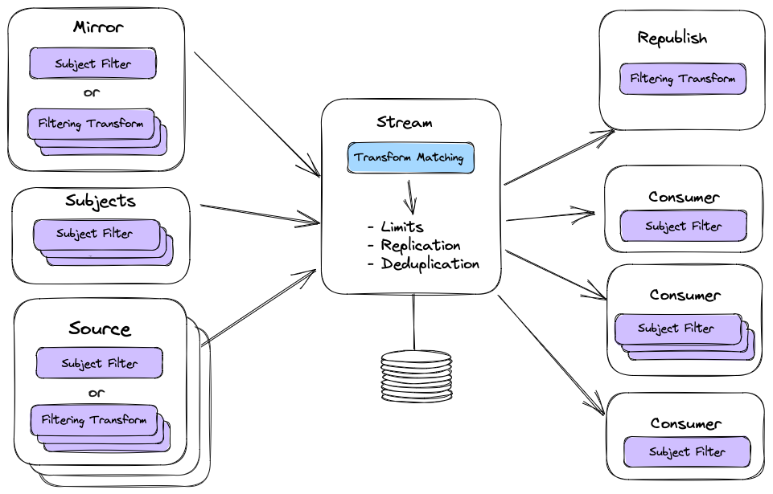

# Subject Mapping Transforms in Streams

|Metadata| Value         |
|--------|---------------|
|Date    | 2023-02-10    |
|Author  | @jnmoyne      |
|Status  | Implemented   |
|Tags    | jetstream, client, server |

## Context and Problem Statement

Subject mapping and transformation is only available at the Core NATS level, meaning that in order to define or modify mappings one has to either have access to the server config file, or have access to the account's key in operator security mode. While Core NATS subject mapping has its place and use (e.g. scaling a single stream for writes using partitioning, traffic routing, A/B and Canary testing), many (most) use cases for subject mapping happen in the context of streams, and having to go to the Core NATS server/account level to define subject mappings is quite limiting as it's not easy for an application programmer to be able to define the mappings he/she needs (even if they have access to the account's key).

On the other hand allowing the application of subject mapping transforms at the stream level makes it very easy for the application developers or the NATS administrators to define and manage those mappings. There is more than one place in a stream's message flow where subject mapping transforms can be applied which enables some very interesting new functionalities (e.g. KV bucket sourcing).

## Prior Work

See [ADR-30](ADR-30.md) for Core NATS subject mapping and a description of the available subject transform functions.

## Features introduced

The new features introduced by version 2.10 of the NATS server allow the application of subject mapping transformations in multiple places in the stream configuration:

- You can apply a subject mapping transformation as part of a Stream mirror.
- You can apply a subject mapping transformation as part of a Stream source.
  - Amongst other use cases, this enables the ability to do sourcing between KV bucket  (as the name of the bucket is part of the subject name in the KV bucket streams, and therefore has to be transformed during the sourcing as the name of the sourcing bucket is different from the name(s) of the bucket(s) being sourced).
- You can apply a subject mapping transformation at the ingres (input) of the stream, meaning after it's been received on Core NATS, or mirrored or sourced from another stream, and before limits are applied (and it gets persisted). This subject mapping transformation is only that, it does not filter messages, it only transforms the subjects of the messages matching the subject mapping source.
  - This enables the ability to insert a partition number as a token in the message subjects.
- You can also apply a subject mapping transformation as part of the re-publishing of messages.

Subject mapping transformation can be seen as an extension of subject filtering, there can not be any subject mapping transformation without an associated subject filter.

A subject filtering and mapping transform is composed of two parts: a subject filter (the 'source' part of the transform) and the destination transform (the 'destination' part of the transform). An empty (i.e. `""`) destination transform means _NO transformation_ of the subject.



Just like streams and consumers can now have more than one single subject filter, mirror and sources can have more than one set of subject filter and transform destination.

Just like with consumers you can either specify a single subject filter and optional subject transform destination or an array of subject transform configs composed of a source filter and optionally empty transform destination.

In addition, it is now possible to source not just from different streams but also from the same stream more than once.

If you define a single source with multiple subject filters and transforms, in which case the ordering of the messages is guaranteed to be preserved, there can not be any overlap between the filters. If you define multiple sources from the same stream, subject filters can overlap between sources thereby making it possible to duplicate messages from the sourced stream, but the order of the messages between the sources is not guaranteed to be preserved.

For example if a stream contains messages on subjects "foo", "bar" and "baz" and you want to source only "foo" and "bar" from that stream you could specify two subject transforms (with an empty destination) in a single source, or you can source twice from that stream once with the "foo" subject filter and a second time with the "bar" subject filter.

## Stream config structure changes

From the user's perspective these features manifest themselves as new fields in the Stream Configuration request and Stream Info response messages.

In Mirror and Sources :
- Additional `"subject_transforms"` array in the `"sources"` array and in `"mirror"` containing objects made of two string fields: `"src"` and `"dest"`. Note that if you use the `"subject_transforms"` array then you can _NOT_ also use the single string subject filters. The `"dest"` can be empty or `""` in which case there is no transformation, just filtering.

At the top level of the Stream Config:
- Additional `"subject_transform"` field in Stream Config containing two strings: `"src"` and `"dest"`. 

## KV bucket sourcing

Subject transforms in streams open up the ability to do sourcing between KV buckets. The client library implements this by automatically adding the subject transform to the source configuration of the underlying stream for the bucket doing the sourcing.

The transform in question should map the subject names from the sourced bucket name to the sourcing's bucket name.

e.g. if bucket B sources A the transform config for the source from stream A in stream B should have the following transform in the SubjectTransforms array for that StreamSource:
```
{
  "src": "$KV.A.>",
  "dest": "$KV.B.>"
}
```

## Examples

A stream that mirrors the `sourcedstream` stream using two subject filters and transform (in this example `foo` is transformed, but `bar` is not):

```JSON
{
  "name": "sourcingstream",
  "retention": "limits",
  "max_consumers": -1,
  "max_msgs_per_subject": -1,
  "max_msgs": -1,
  "max_bytes": -1,
  "max_age": 0,
  "max_msg_size": -1,
  "storage": "file",
  "discard": "old",
  "num_replicas": 1,
  "duplicate_window": 120000000000,
  "mirror":
  {
    "name": "sourcedstream",
    "subject_transforms": [
      {
        "src": "foo",
        "dest": "foo-transformed"
      },
      {
        "src": "bar",
        "dest": ""
      }
    ]
  },
  "sealed": false,
  "deny_delete": false,
  "deny_purge": false,
  "allow_rollup_hdrs": false,
  "allow_direct": false,
  "mirror_direct": false
}
```

A stream that sources from the `sourcedstream` stream twice, each time using a single subject filter and transform:

```JSON
{
  "name": "sourcingstream",
  "retention": "limits",
  "max_consumers": -1,
  "max_msgs_per_subject": -1,
  "max_msgs": -1,
  "max_bytes": -1,
  "max_age": 0,
  "max_msg_size": -1,
  "storage": "file",
  "discard": "old",
  "num_replicas": 1,
  "duplicate_window": 120000000000,
  "sources": [
    {
      "name": "sourcedstream",
      "subject_transforms": [
        {
          "src": "foo",
          "dest": "foo-transformed"
        }
      ]
    },
    {
      "name": "sourcedstream",
      "subject_transforms": [
        {
          "src": "bar",
          "dest": "bar-transformed"
        }
      ]
    }
  ],
  "sealed": false,
  "deny_delete": false,
  "deny_purge": false,
  "allow_rollup_hdrs": false,
  "allow_direct": false,
  "mirror_direct": false
}
```

A Stream that sources from 2 streams and has a subject transform:

```JSON
{
  "name": "foo",
  "retention": "limits",
  "max_consumers": -1,
  "max_msgs_per_subject": -1,
  "max_msgs": -1,
  "max_bytes": -1,
  "max_age": 0,
  "max_msg_size": -1,
  "storage": "file",
  "discard": "old",
  "num_replicas": 1,
  "duplicate_window": 120000000000,
  "sources": [
    {
      "name": "source1",
      "filter_subject": "stream1.foo.>"
    },
    {
      "name": "source1",
      "filter_subject": "stream1.bar.>"
    },
    {
      "name": "source2",
      "subject_transforms": [
        {
          "src": "stream2.foo.>",
          "dest": "foo2.>"
        },
        {
          "src": "stream2.bar.>",
          "dest": "bar2.>"
        }
      ]
    }
  ],
  "subject_transform": {
    "src": "foo.>",
    "dest": "mapped.foo.>"
  },
  "sealed": false,
  "deny_delete": false,
  "deny_purge": false,
  "allow_rollup_hdrs": false,
  "allow_direct": false,
  "mirror_direct": false
}
```
## Client implementation PRs

- [jsm.go](https://github.com/nats-io/jsm.go/pull/436) [and](https://github.com/nats-io/jsm.go/pull/461)
- [nats.go](https://github.com/nats-io/nats.go/pull/1200) [and](https://github.com/nats-io/nats.go/pull/1359)
- [natscli](https://github.com/nats-io/natscli/pull/695) [and](https://github.com/nats-io/natscli/pull/845)