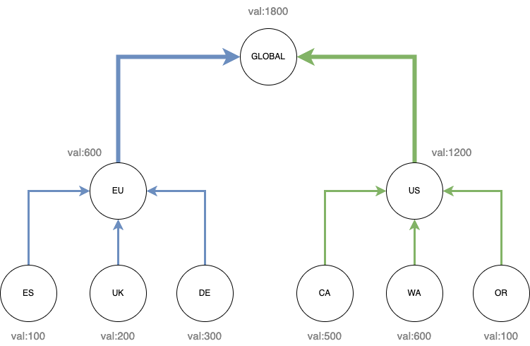

# JetStream Distributed Counter CRDT

| Metadata | Value                 |
|----------|-----------------------|
| Date     | 2025-04-14            |
| Author   | @ripienaar            |
| Status   | Approved              |
| Tags     | jetstream, spec, 2.12 |

## Revision History

| Revision | Date       | Description                      | Refinement | Server Requirement |
|----------|------------|----------------------------------|------------|--------------------|
| 1        | 2025-04-14 | Document Initial Design          |            | 2.12.0             |
| 2        | 2025-06-12 | Server will always use `big.Int` |            |                    |
| 3        | 2025-06-19 | Source-aware tracking            |            |                    |

## Context and Motivation

We wish to provide a distributed counter that will function in Clusters, Super Clusters, through Sources and any other way that data might reach a Stream.

We will start with basic addition and subtraction primitives which will automatically behave as a CRDT and be order independent.

Related:

 * [Netflix Distributed Counter](https://netflixtechblog.com/netflixs-distributed-counter-abstraction-8d0c45eb66b2)

## Solution Overview

A Stream can opt-in to supporting Counters which will allow any subject to be a counter. All subjects in the stream must
be counters.

Publishing a message to such a Stream will load the most recent message on the subject, increment its value and save 
the new message with the latest value in the body. The header is preserved for downstream processing by Sources and for 
visibility and debugging purposes.

The `PubAck` will include the value post-increment for fast feedback, avoiding a Get to get the latest value.

```bash
$ nats s get COUNTER --last-for counter.hits
Item: COUNTER#22802062 received 2025-01-09 18:05:07.93747413 +0000 UTC on Subject counter.hits

Headers:
  Nats-Incr: +2

{"val":"100"}
$ nats req counter.hits '' -J -H "Nats-Incr:+1"
{"stream":"COUNTER", "domain":"hub", "seq":22802063, "val":"101"}
$ nats s get COUNTER --last-for counter.hits
Item: COUNTER#22802063 received 2025-01-09 18:06:00 +0000 UTC on Subject counter.hits

Headers:
  Nats-Incr: +1

{"val":"101"}
```

## Design and Behavior

The goal is to support addition and subtraction only and so that a Stream that Sources 10s of other Streams all with 
counters will effectively create a big combined counter holding totals contributed to by all sources.

Handling published messages has the follow behavior and constraints:

 * The header holds values like `+1`, `-1` and `-10`, in other words any valid `BigInt`, if the value fails to parse 
   the message is rejected with an error. A value of `0` is valid. A valid message is `^[+-]\d+$` with the additional checks
   around `BigInt` maximal values
 * When publishing a message to the subject the last value is loaded by the server receiving the message (so the leader), 
   the body is parsed, incremented and written into the new message body. The headers are all preserved
 * When rewrites are in place on the Stream, the rewritten subject should be used to perform the calculation
 * A Stream with the option set will reject all messages without `Nats-Incr`
 * When a message has a `Nats-Rollup`, `Nats-Expected-Last-Sequence`, `Nats-Expected-Subject-Last-Sequence`, `Nats-Expected-Stream` or `Nats-Expected-Last-Msg-Id` header must be rejected
 * When a message with the header is published to a Stream without the option set the message is rejected with an error
 * When a message with the header is received over a Source (with the setting disabled) or Mirror the message is stored verbatim
 * When the previous message in the stream has the `Nats-Counter-Sources` header, it must be copied into the new message, with or without modifications as needed below. This is necessary to ensure that we never lose sourcing state and that changes from sources can always be reconciled.
 * When a message is received over a Source, with a `Nats-Stream-Source` header:
    1. The `Nats-Incr` value will be overwritten with the delta between the last seen `"val"` for that source (as stored in the `Nats-Counter-Sources` header) and the new one
    2. The `Nats-Counter-Sources` header will then be updated with the new sourced `"val"` for that particular source

The value in the body is stored in a struct with the following layout:

```go
type CounterValue struct {
	Value string `json:"val"`
}
```

We use a `string` value since JavaScript would only support up to `2^53` for number, we might want to support BigInt and others in future.

We use a JSON result so we can extend the structure in future, perhaps to indicate data type and more.

The PubAck gets a new field:

```go
type PubAck struct {
	// ....
	Value string `json:"val,omitempty"`
}
```

## Recounts and Audit

It's important in many scenarios that counter values can be audited and recounts can happen. We preserve the `Nats-Incr` 
header separate from the body so given streams with no limits applied one can manually recount the entire stream.

In the case of sourced streams the headers that sourcing adds will provide further providence for a specific click.

## Counter Resets

It's important that counters can be reset to zero, in a simple standalone counter this is easily done with a subject purge. 
In a topology where multiple regions contribute to a total via sourcing a regional reset might require a negative value to 
be published equal to the current total.

The preferred method for Reset should be a negative value being published followed by a purge up to the message holding 
the negative value, with subject purge being used only for entire counter deletes.

## Source-based Replicated Counters

We want to be able to build large replicated global counters formed of multiple tiers with a running count kept at
each tier.

Use this for Counters where full, or long term, history can be kept and as little as possible client side work is needed
to obtain the total values.



When the counter is read at any location in the tree the value shown should be returned - the total of all messages that
flowed through a particular server.

In order to get a fully global counter we end up with the same subject in all these Streams and locations and might end
up with double writes if all Streams listen on the same subject.

To solve this problem we configure regions to listen on subjects like `count.es.hits` and we use rewriting during the 
sourcing to turn that into `count.eu.hits` and eventually `count.hits` with the aggregate streams possibly not listening 
on any subject. 

In this scenario we lose the ability to access the `count.es.hits` value anywhere other than in the `es` location - not 
ideal. One could mirror from ES -> EU cluster and then Source in the EU cluster into an aggregate counter thus retaining 
the source and total.

Replicated counters further complicates matter wrt counter resets. In a standalone counter one can just purge the subject 
to reset it. In the replicated case a purge will not replicate, a roll-up would replicate and destroy the entire counter 
everywhere so the only real option is to publish a negative value into the particular point in the tree structure where
you want to reset.

### Adding Sources

Adding a source that uses a subject transform to merge an upstream counter into an aggregate one is supported through a
source-tracking `Nats-Counter-Sources` header, which is automatically populated and maintained by the server.

The `Nats-Counter-Sources` keys each source based on the stream name & original pre-transformed subject and contains the most
recently seen `"val"` for each source.

When a message is received from a source, as determined by the presence of the `Nats-Stream-Source` header, the server will
not use the sourced `Nats-Incr` value to update the counter verbatim, but will instead rewrite `Nats-Incr` to reflect the
delta between the last seen `"val"` for that source and the new one.

This way, it is possible to replay `Nats-Incr` headers and recount on the aggregate stream even if some messages from the
source were lost, i.e. due to message retention policies, network outages etc, and still arrive at the correct total.

This also means that adding a source that has a non-zero counter is possible and the `Nats-Incr` header will include that
initial count, i.e. adding source counter with an existing value of 10 will result in the first sourced count having a 
`Nats-Incr: 10`. 

Note that once a source key is added to this map, it is not ever removed, so that if the stream source is removed and
re-added later to the stream config, the server will be able to do the right thing and determine the difference during
that time, instead of re-adding the whole value and potentially ending up with a miscount on the aggregated stream.

These properties mean that aggregated counters will always be eventually consistent with their sources, even if the
aggregating stream also has local additions or subtractions that were not themselves sourced.

## Stream Configuration

Weather or not a Stream support this behavior should be a configuration opt-in since once enabled only Counters can exist
in the Stream

```golang
type StreamConfig struct {
	// AllowMsgCounter enables the feature
	AllowMsgCounter bool          `json:"allow_msg_counter"`
}
```

 * Setting this on a Mirror should cause an error
 * Setting this on a stream with anything but Limits retention should cause an error
 * This feature can be turned off and on using Stream edits, turning it on should only be allowed on an empty, or purged, Stream.
 * Stream should not support Discard New with this setting set
 * This setting may not be enabled along with Per Message TTLs
 * A Stream with this feature on should require API level 2

## Client Considerations

The client work can be considered part of the Typed Key-Value initiatives where the API gets additional behaviours
in the KV Entry to indicate an Entry is a counter and a way to get the numeric value.  The API can also get something
like `bucket.Increment("counter.hits", 10)`.

This seems like a reasonable surface area to add, but, it does stretch the behaviours of what is by design a simplification
over Streams into a ever broader and more complicated to adopt and maintain surface area, potentially harming the very
reason Key-Value stores are attractive.

Additionally the management features for Counters are very purpose specific and would not belong in KV.

So we propose to follow the new standard approach of landing something in Orbit and merging it back later into core clients 
if deemed suitable.  At that point it might become an extension on KV if it makes sense. 

In this case a dedicated light weight Counter client to begin with would be added to Orbit:

> [!NOTE]  
> This is just an idea at present, the client will be fleshed out later in the development cycle.

```go
``package counters

import "math/big"

type Counter interface {
     // Adds or subtracts a value from the counter, returning the new value.
     Add(counter string, value big.Int) (big.Int, error)
     // Load retrieves the current value of the counter, using direct get with no headers.
     Load(counter string) (big.Int, error)
     // LoadMultiple retrieves the current values of multiple counters, using direct get with no headers.
     // It allows using wildcards in the counter names.
     LoadMultiple(counters []string) (Values, error)
     // Get retrieves the current value of a counter, including its sources.
     GetEntry(counter string) (Entry, error)
     // GetMany retrieves the current values of multiple counters, including their sources.
     // It allows using wildcards in the counter names.
     GetEntries(counters []string) (Entries, error)
}

type Entry struct {
    Value big.Int
    // TODO: maybe there is a prettier way to represent the sources.
    // For now, we're using the server representation.
    Sources  map[string]map[string]string
}

// Allows iterating over multiple counters values.
type Values struct {}


// Allows iterating over multiple counter Entries.
type Entries struct {}

`
