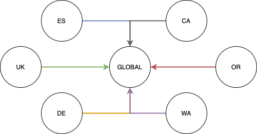

# JetStream Distributed Counter CRDT

| Metadata | Value                 |
|----------|-----------------------|
| Date     | 2025-04-14            |
| Author   | @ripienaar            |
| Status   | Approved              |
| Tags     | jetstream, spec, 2.12 |

## Revision History

| Revision | Date       | Description                      | Refinement | Server Requirement |
|----------|------------|----------------------------------|------------|--------------------|
| 1        | 2025-04-14 | Document Initial Design          |            | 1.12.0             |
| 2        | 2025-06-12 | Server will always use `big.Int` |            |                    |

## Context and Motivation

We wish to provide a distributed counter that will function in Clusters, Super Clusters, through Sources and any other way that data might reach a Stream.

We will start with basic addition and subtraction primitives which will automatically behave as a CRDT and be order independent.

Related:

 * [Netflix Distributed Counter](https://netflixtechblog.com/netflixs-distributed-counter-abstraction-8d0c45eb66b2)

## Solution Overview

A Stream can opt-in to supporting Counters which will allow any subject to be a counter. All subjects in the stream must
be counters.

Publishing a message to such a Stream will load the most recent message on the subject, increment its value and save 
the new message with the latest value in the body. The header is preserved for downstream processing by Sources and for 
visibility and debugging purposes.

```bash
$ nats s get COUNTER --last-for counter.hits
Item: COUNTER#22802062 received 2025-01-09 18:05:07.93747413 +0000 UTC on Subject counter.hits

Headers:
  Nats-Incr: +2

{"val":"100"}
$ nats pub counter.hits '' -J -H "Nats-Incr:+1"
$ nats s get COUNTER --last-for counter.hits
Item: COUNTER#22802063 received 2025-01-09 18:06:00 +0000 UTC on Subject counter.hits

Headers:
  Nats-Incr: +1

{"val":"101"}
```

## Design and Behavior

The goal is to support addition and subtraction only and so that a Stream that Sources 10s of other Streams all with 
counters will effectively create a big combined counter holding totals contributed to by all sources.

Handling published messages has the follow behavior and constraints:

 * The header holds values like `+1`, `-1` and `-10`, in other words any valid `BigInt`, if the value fails to parse 
   the message is rejected with an error. A value of `0` is valid. A valid message is `^[+-]\d+$` with the additional checks
   around `BigInt` maximal values
 * When publishing a message to the subject the last value is loaded by the server receiving the message (so the leader), 
   the body is parsed, incremented and written into the new message body. The headers are all preserved
 * When rewrites are in place on the Stream, the rewritten subject should be used to perform the calculation
 * If the result will overflow an `BigInt` in either direction the message will be rejected with an error
 * A Stream with the option set will reject all messages without `Nats-Incr`
 * When a message has a `Nats-Rollup`, `Nats-Expected-Last-Sequence`, `Nats-Expected-Subject-Last-Sequence`, `Nats-Expected-Stream` or `Nats-Expected-Last-Msg-Id` header must be rejected
 * When a message with the header is published to a Stream without the option set the message is rejected with an error
 * When a message with the header is received over a Source or Mirror the message is stored verbatim

The value in the body is stored in a struct with the following layout:

```go
type CounterValue struct {
	Value string `json:"val"`
}
```

We use a `string` value since JavaScript would only support up to `2^53` for number, we might want to support BigInt and others in future.

We use a JSON result so we can extend the structure in future, perhaps to indicate data type and more.

## Recounts and Audit

It's important in many scenarios that counter values can be audited and recounts can happen. We preserve the `Nats-Incr` 
header separate from the body so given streams with no limits applied one can manually recount the entire stream.

In the case of sourced streams the headers that sourcing adds will provide further providence for a specific click.

## Counter Resets

It's important that counters can be reset to zero, in a simple standalone counter this is easily done with a subject purge. 
In a topology where multiple regions contribute to a total via sourcing a regional reset might require a negative value to 
be published equal to the current total.

The preferred method for Reset should be a negative value being published followed by a purge up to the message holding 
the negative value, with subject purge being used only for entire counter deletes.

## Source-based Replicated Counters

We will support two strategies for combining multiple Counters into a global view.

 * Aggregated Counters suitable for shorter lived, fully audited, counters
 * Client-Assisted Sourced Counters suitable for high throughput, long lived, counters

> [!NOTE]  
> This covers what is possible with current Sourcing features, once the working feature is implemented we will
> look at adding Counter awareness to Sources to alleviate some of the short comings detailed below

### Aggregated

We want to be able to build large replicated global counters formed of multiple tiers with a running count kept at
each tier.

Use this for Counters where full, or long term, history can be kept and as little as possible client side work is needed
to obtain the total values.


When the counter is read at any location in the tree the value shown should be returned - the total of all messages that
flowed through a particular server.

In order to get a fully global counter we end up with the same subject in all these Streams and locations and might end
up with double writes if all Streams listen on the same subject.

To solve this problem we configure regions to listen on subjects like `count.es.hits` and we use rewriting during the 
sourcing to turn that into `count.eu.hits` and eventually `count.hits` with the aggregate streams possibly not listening 
on any subject. 

In this scenario we lose the ability to access the `count.es.hits` value anywhere other than in the `es` location - not 
ideal. One could mirror from ES -> EU cluster and then Source in the EU cluster into an aggregate counter thus retaining 
the source and total.

Replicated counters further complicates matter wrt counter resets. In a standalone counter one can just purge the subject 
to reset it. In the replicated case a purge will not replicate, a roll-up would replicate and destroy the entire counter 
everywhere so the only real option is to publish a negative value into the particular point in the tree structure where
you want to reset.

In this scenario users must take care to configure limits appropriately, at no point may a down Source miss messages,
this means if a Source is down for a day, there must be history to cover that period. Each aggregation point must also
be configured to be a Counter.

#### Adding Sources

Adding a source that already has values in it and that had limits applied will be problematic since we will not have the 
history to fully recount the message in the target Stream. Additionally if a Source had many messages adding in the whole
source might be computationally too expensive, especially when the history is not important.

Tooling might use a direct get to retrieve that value in the source, place that value into the target Stream and then 
start the sourcing from seq+1, meaning we snapshot the Source value into the target and then only handle new counts.  
This will scale well and avoid huge recounts, but, would require the target Stream to have a subject.

### Client-Assisted

We want to support long-lived, high throughput, Counters where full audit trail is not needed and where Source
outages of any period will resolve in a eventually consistent manner without loss of Counts. The aggregation
Streams do not recount the entire global Counter.



Here the colors indicate that the Counters are not combined by the Streams but that each Counter is simply copied. A 
multi-tier arrangement as above can also be constructed.

The Counters are sourced into a Stream that combines the other Streams and stores the data verbatim.  The 
combination Streams are not configured to be a Counters.

Reads are done on a client-assisted manner meaning we use a Batch Direct Get of all the subjects that make up the
Counter and simply sum their values together in the client.  This results in a consistent point in time read.

The Streams can all have quite small Max Messages Per Subject limits allowing control of the storage space and would
improve the overall performance of these Streams if configured for 2 messages per subject.

Even with short limits applied only the latest message matter, if some messages are lost during a Source outage they 
will resume to the correct value after the outage.

## Stream Configuration

Weather or not a Stream support this behavior should be a configuration opt-in since once enabled only Counters can exist
in the Stream

```golang
type StreamConfig struct {
	// AllowMsgCounter enables the feature
	AllowMsgCounter bool          `json:"allow_msg_counter"`
}
```

 * Setting this on a Mirror should cause an error.
 * This feature can be turned off and on using Stream edits, turning it on should only be allowed on an empty, or purged, Stream.
 * Stream should not support Discard New with this setting set
 * This setting may not be enabled along with Per Message TTLs
 * A Stream with this feature on should require API level 2

## Client Considerations

The client work can be considered part of the Typed Key-Value initiatives where the API gets additional behaviours
in the KV Entry to indicate an Entry is a counter and a way to get the numeric value.  The API can also get something
like `bucket.Increment("counter.hits", 10)`.

This seems like a reasonable surface area to add, but, it does stretch the behaviours of what is by design a simplification
over Streams into a ever broader and more complicated to adopt and maintain surface area, potentially harming the very
reason Key-Value stores are attractive.

Additionally the management features for Counters are very purpose specific and would not belong in KV.

So we propose to follow the new standard approach of landing something in Orbit and merging it back later into core clients 
if deemed suitable.  At that point it might become an extension on KV if it makes sense. 

In this case a dedicated light weight Counter client to begin with would be added to Orbit:

> [!NOTE]  
> This is just an idea at present, the client will be fleshed out later in the development cycle.

```go
// Creates a new counter abstraction bound to a Stream
func NewCounter(stream jetstream.Stream) (Counter, error)

// Parses a messages received from a consumer into a counter entry
func ParseMessage(msg jetstream.Msg) (Entry, error)

// Entry holds helpers for parsing the values in counters
type Entry interface {
	// Value parses the value as a big.Int
	Value() (big.Int, error)
	
// The messages that contributed to the Value
	Messages() []jetstream.Msg
}

// Increments and loads 
type Counter interface {
    // Increments a counter by delta
    func Increment(subject string, value int64) (Entry, error)
	
    // Loads the value from the stream subject, options to supply a specific seq/time for example
    func Load(subject string, opts ...LoadOption) (Entry, error)

    // Loads a group of subjects from the same stream using a direct batch get, performs the
    // calculation to combine these numbers client side
    func LoadMulti(subjects []string, opts ...LoadOptions) ([]Entry, error)
}
```
