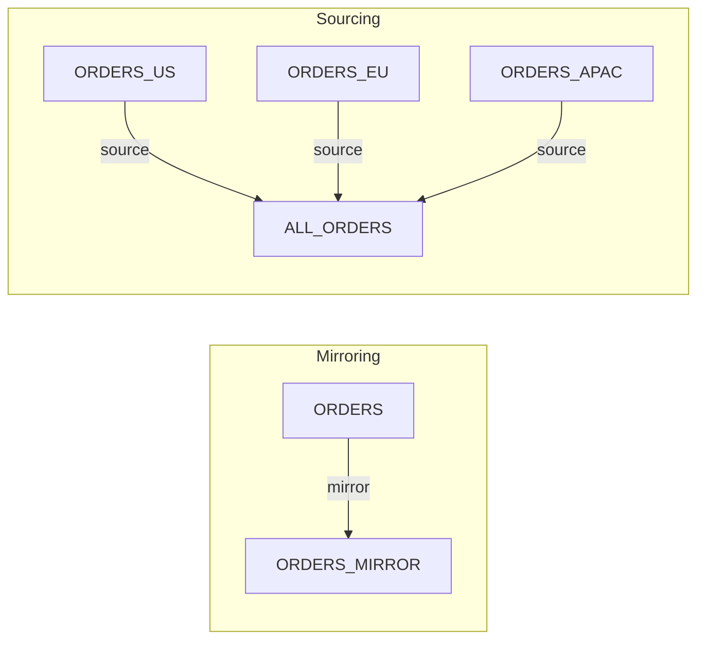
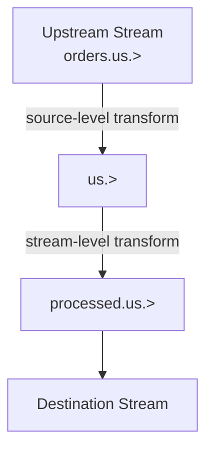
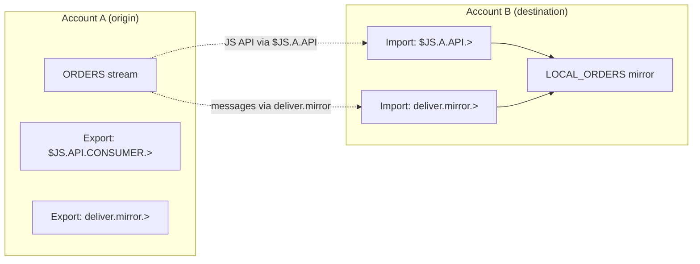
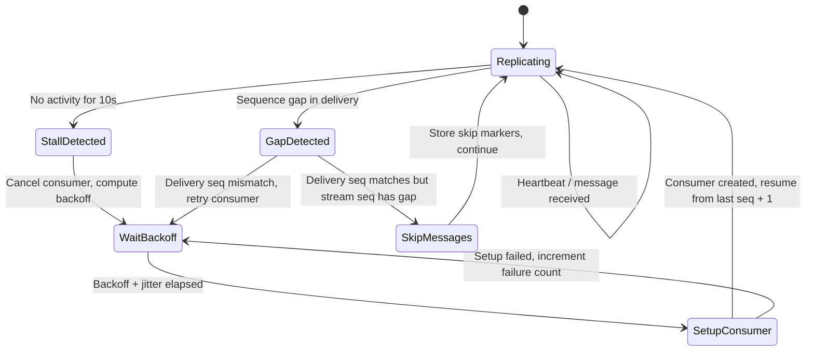

# JetStream Stream Sourcing and Mirroring

| Metadata | Value                |
|----------|----------------------|
| Date     | 2026-03-03           |
| Author   | @ripienaar           |
| Status   | Implemented          |
| Tags     | server, jetstream, spec |

| Revision | Date       | Author      | Info                                          |
|----------|------------|-------------|-----------------------------------------------|
| 1        | 2026-03-03 | @ripienaar  | Initial spec, documents features up to 2.12   |

## Context

JetStream provides two mechanisms for replicating data between streams: **Mirroring** and **Sourcing**. These features
enable use cases such as read replicas, data aggregation, geographic distribution, cross-account data sharing, and
building data pipelines with subject transformation.

While these features have been available since the introduction of JetStream, there is no single document that describes
their complete behavior. This ADR serves as the authoritative reference for stream sourcing and mirroring.

## Overview

**Mirroring** creates an exact, read-only copy of a single upstream stream. A mirror maintains the same message ordering
as the origin and is primarily used for read scaling, disaster recovery, and geographic distribution.

**Sourcing** aggregates messages from one or more upstream streams into a single destination stream. Sources support
flexible filtering and subject transformation, making them suitable for data aggregation, fan-in patterns, and building
derived data views.

Both features work within a single account, across accounts, and across JetStream domains.



## Configuration

Both mirrors and sources use the `StreamSource` configuration type:

```go
type StreamSource struct {
	Name              string                   `json:"name"`
	OptStartSeq       uint64                   `json:"opt_start_seq,omitempty"`
	OptStartTime      *time.Time               `json:"opt_start_time,omitempty"`
	FilterSubject     string                   `json:"filter_subject,omitempty"`
	SubjectTransforms []SubjectTransformConfig `json:"subject_transforms,omitempty"`
	External          *ExternalStream          `json:"external,omitempty"`
}

type SubjectTransformConfig struct {
	Source      string `json:"src"`
	Destination string `json:"dest"`
}

type ExternalStream struct {
	ApiPrefix     string `json:"api"`
	DeliverPrefix string `json:"deliver"`
}
```

```json
{
  "name": "ORDERS",
  "opt_start_seq": 100,
  "opt_start_time": "2024-01-01T00:00:00Z",
  "filter_subject": "orders.us.>",
  "subject_transforms": [
    {"src": "orders.us.>", "dest": "processed.>"}
  ],
  "external": {
    "api": "$JS.EAST.API",
    "deliver": "deliver.from.east"
  }
}
```

| Field                | Description                                                                                     | Default         |
|----------------------|-------------------------------------------------------------------------------------------------|-----------------|
| `name`               | Name of the upstream stream to source or mirror from. Required.                                 | —               |
| `opt_start_seq`      | Start replicating from this sequence number. Only applies on first creation. Mutually exclusive with `opt_start_time`. | `0` (all messages) |
| `opt_start_time`     | Start replicating from this point in time. Only applies on first creation. Mutually exclusive with `opt_start_seq`. | `null` (all messages) |
| `filter_subject`     | Only replicate messages matching this subject filter. Supports wildcards. Mutually exclusive with `subject_transforms`. | `""` (all subjects) |
| `subject_transforms` | Transform message subjects as they are replicated. See [Subject Transforms](#subject-transforms). Mutually exclusive with `filter_subject`. | `[]`            |
| `external`           | Access a stream in another account or JetStream domain. See [External Streams](#external-streams). | `null` (local)  |

This type is used in the stream configuration as follows:

```json
{
  "name": "MY_MIRROR",
  "mirror": {
    "name": "ORDERS"
  }
}
```

```json
{
  "name": "AGGREGATED",
  "subjects": ["direct.>"],
  "sources": [
    {"name": "ORDERS_US", "filter_subject": "orders.>"},
    {"name": "ORDERS_EU", "filter_subject": "orders.>"}
  ]
}
```

## Mirroring

A mirror stream is an exact, continuously-updated copy of a single upstream stream.

### Behavior

- A mirror creates a hidden internal consumer on the upstream stream and replicates messages as they arrive.
- Messages are delivered in the same order and with the same sequence numbers as the upstream stream.
- The mirror is read-only: clients cannot publish directly to a mirror stream.
- A mirror stream cannot have `subjects` configured since it does not accept direct publishes.
- A stream can mirror at most one stream. Multiple streams can mirror the same stream.
- The `mirror` and `sources` fields are mutually exclusive.

### Creating a Mirror

A minimal mirror configuration:

```json
{
  "name": "ORDERS_MIRROR",
  "mirror": {
    "name": "ORDERS"
  }
}
```

A mirror that only replicates a subset of subjects:

```json
{
  "name": "ORDERS_US_MIRROR",
  "mirror": {
    "name": "ORDERS",
    "filter_subject": "orders.us.>"
  }
}
```

### Starting Position

When a mirror is first created, you can control where replication begins:

- **Default**: All available messages are replicated from the upstream stream (`DeliverAll` policy).
- **`opt_start_seq`**: Start from a specific sequence number in the upstream stream.
- **`opt_start_time`**: Start from a specific point in time.

These two options are **mutually exclusive** — the server will reject a configuration that sets both.

These settings only take effect on first creation. On restart, the mirror resumes from its last known position.

### Mirror Updates

Mirror configuration **cannot be changed** after creation. To change the mirror configuration, the stream must be
deleted and recreated. However, a mirror can be "promoted" by removing the stream subjects on the stream that's mirrored, and then removing the mirror configuration on this stream, as well as adding the former's stream subjects to it.

### Mirror Direct Access

When the upstream stream has `allow_direct` enabled, the mirror stream can set `mirror_direct` to enable high-performance
direct get access. This is particularly useful for Key-Value store mirrors where reads should be served
from the nearest replica.

```json
{
  "name": "KV_ORDERS_MIRROR",
  "mirror": {"name": "KV_ORDERS"},
  "mirror_direct": true
}
```

When `mirror_direct` is enabled and the mirror has caught up to the upstream stream, direct get requests can be served
by the nearest mirror rather than routing to the origin stream. The `StreamInfo` response includes an `alternates`
field listing available mirrors sorted by RTT proximity.

### Restrictions

Mirror streams cannot be combined with:

- `subjects` — mirrors do not accept direct publishes
- `sources` — a stream is either a mirror or has sources, not both
- `first_seq` — mirrors derive their starting position from the upstream stream
- `allow_msg_counter` — message counters are incompatible with mirrors
- `allow_atomic` — atomic batch publishing cannot target mirrors
- `allow_msg_schedules` — message scheduling is not supported on mirrors
- `subject_delete_marker_ttl` — delete markers would insert new messages and break sequence alignment

Mirror streams can use:

- `subject_transform` (stream-level) — applied to all replicated messages after storage
- `republish` — republishes messages to other subjects after storage
- `compression` — compresses stored data
- `allow_msg_ttl` — TTL headers on replicated messages are honored

## Sourcing

A sourced stream aggregates messages from one or more upstream streams.

### Behavior

- A source creates a hidden internal consumer on each upstream stream and replicates matching messages.
- Messages from each individual source maintain their relative ordering.
- When sourcing from multiple streams, messages are interleaved in arrival order. There is no guaranteed ordering
  across different sources.
- A sourced stream **can** also have its own `subjects` and accept direct publishes, combining sourced and
  directly-published messages in a single stream.
- Multiple sources can reference the same upstream stream if they have different filters or transforms (see
  [Duplicate Detection](#duplicate-detection)).

### Creating Sources

A stream sourcing from multiple upstreams:

```json
{
  "name": "ALL_ORDERS",
  "sources": [
    {"name": "ORDERS_US"},
    {"name": "ORDERS_EU"},
    {"name": "ORDERS_APAC"}
  ]
}
```

A stream sourcing filtered subsets with subject transformation:

```json
{
  "name": "PRIORITY_ORDERS",
  "sources": [
    {
      "name": "ORDERS_US",
      "subject_transforms": [
        {"src": "orders.us.priority.>", "dest": "priority.us.>"}
      ]
    },
    {
      "name": "ORDERS_EU",
      "subject_transforms": [
        {"src": "orders.eu.priority.>", "dest": "priority.eu.>"}
      ]
    }
  ]
}
```

### Starting Position

Each source independently supports `opt_start_seq` and `opt_start_time` to control where replication begins.
These two options are **mutually exclusive** per source entry — the server will reject a configuration that sets both.

```json
{
  "name": "RECENT_ORDERS",
  "sources": [
    {"name": "ORDERS_US", "opt_start_time": "2024-06-01T00:00:00Z"},
    {"name": "ORDERS_EU", "opt_start_seq": 5000}
  ]
}
```

As with mirrors, these only apply on first creation. On restart, each source resumes from its last known position.

### Source Updates

Sources **can be added or removed** after stream creation by updating the stream configuration. Existing source
entries cannot be modified — to change a source's filter or transform, remove it and add a new one.

### Duplicate Detection

Two source entries are considered duplicates if they have the same combination of:

- Stream name
- Filter subject
- Subject transforms
- External API prefix

This means you can source the same upstream stream multiple times as long as the filter or transforms differ:

```json
{
  "name": "SPLIT_ORDERS",
  "sources": [
    {"name": "ORDERS", "filter_subject": "orders.us.>"},
    {"name": "ORDERS", "filter_subject": "orders.eu.>"}
  ]
}
```

### Restrictions

Sourced streams cannot be combined with:

- `mirror` — a stream is either a mirror or has sources, not both
- `allow_msg_schedules` — message scheduling is not supported on sourced streams

Sourced streams can use:

- `subjects` — accept direct publishes alongside sourced messages
- `subject_transform` (stream-level) — applied to all messages
- `republish` — republishes messages after storage
- `compression`, `allow_msg_ttl`, and most other stream features

## Subject Transforms

Both mirrors and sources support transforming message subjects as they are replicated. This allows the destination
stream to use a different subject namespace than the origin. The core subject transform syntax is described in
[ADR-30](ADR-30.md), and the application of transforms within streams is detailed in [ADR-36](ADR-36.md).

### Filter Subject vs Subject Transforms

Each source or mirror entry supports two mutually exclusive filtering approaches:

- **`filter_subject`**: A single subject filter that selects which messages to replicate. Messages retain their
  original subject.
- **`subject_transforms`**: One or more transform rules, each with a `src` pattern (filter) and a `dest` pattern
  (transformation). This both filters messages and rewrites their subjects.

These cannot be combined on the same source or mirror entry. Use `filter_subject` when you only need to select a
subset of messages. Use `subject_transforms` when you need to rename subjects, or need to use multiple filter subjects.

### Multiple Transforms

When using `subject_transforms`, you can specify multiple transform rules per source. The `src` patterns must not
overlap, and the `dest` pattern is optional (it then equals the `src` pattern):

```json
{
  "name": "NORMALIZED",
  "sources": [
    {
      "name": "RAW_EVENTS",
      "subject_transforms": [
        {"src": "events.click.>", "dest": "normalized.click.>"},
        {"src": "events.view.>",  "dest": "normalized.view.>"}
      ]
    }
  ]
}
```

### Stream-Level Subject Transform

In addition to per-source transforms, the stream itself has a `subject_transform` field that applies to **all**
incoming messages (whether from sources, mirrors, or direct publishes). When combined with source-level transforms,
the order of application is:

1. Source-level `filter_subject` or `subject_transforms` — applied as messages are selected from the upstream
2. Stream-level `subject_transform` — applied to all messages entering the stream



## External Streams

The `external` field allows a mirror or source to access a stream in another JetStream domain or account. This
enables cross-domain data replication and cross-account data sharing.

```json
{
  "name": "LOCAL_ORDERS",
  "mirror": {
    "name": "ORDERS",
    "external": {
      "api": "$JS.EAST.API",
      "deliver": "deliver.east.mirror"
    }
  }
}
```

| Field     | Description                                                                                |
|-----------|--------------------------------------------------------------------------------------------|
| `api`     | The API prefix for the remote JetStream domain. Must be a valid subject without wildcards. |
| `deliver` | The delivery subject prefix for receiving replicated messages.                              |

The `api` prefix is used to send consumer creation requests to the remote domain. The `deliver` prefix is the subject
on which messages from the remote stream will be delivered.

### Cross-Account Access

To source or mirror a stream from another account, you typically configure an `export` in the origin account and an
`import` in the destination account, then reference the imported API and delivery prefixes in the `external`
configuration.



### Cycle Detection

The server automatically detects and prevents cycles in source and mirror relationships within the same account. For
example, if stream A sources from stream B, then stream B cannot source from stream A when the subjects overlap.

Cycle detection **does not** apply across external streams in different domains. It is the operator's responsibility
to ensure that cross-domain configurations do not create replication cycles.

## Monitoring

### Stream Info

The `StreamInfo` response includes the replication status for mirrors and sources using the `StreamSourceInfo` type:

```go
type StreamSourceInfo struct {
	Name              string                   `json:"name"`
	External          *ExternalStream          `json:"external,omitempty"`
	Lag               uint64                   `json:"lag"`
	Active            time.Duration            `json:"active"`
	Error             *ApiError                `json:"error,omitempty"`
	FilterSubject     string                   `json:"filter_subject,omitempty"`
	SubjectTransforms []SubjectTransformConfig `json:"subject_transforms,omitempty"`
}
```

```json
{
  "mirror": {
    "name": "ORDERS",
    "lag": 42,
    "active": 250000000,
    "filter_subject": "orders.us.>",
    "subject_transforms": [],
    "error": null
  },
  "sources": [
    {
      "name": "ORDERS_US",
      "lag": 0,
      "active": 100000000,
      "filter_subject": "orders.>",
      "error": null
    }
  ]
}
```

| Field                | Description                                                                      |
|----------------------|----------------------------------------------------------------------------------|
| `name`               | Name of the upstream stream.                                                     |
| `external`           | The external configuration, if the source is in another domain or account.       |
| `lag`                | Number of messages pending replication from the upstream stream.                  |
| `active`             | Duration since the last activity from this source (in nanoseconds).              |
| `error`              | Any error encountered during replication (e.g., upstream stream not found).       |
| `filter_subject`     | The subject filter in effect, if any.                                            |
| `subject_transforms` | The subject transforms in effect, if any.                                        |

### Lag

The `lag` field indicates how many messages the mirror or source is behind the upstream stream. A `lag` of `0` means
the stream is fully caught up and processing messages in real-time.

### Error Reporting

When the server cannot establish or maintain a replication consumer, the error is recorded in the `error` field of
`StreamSourceInfo`. This field is an `ApiError` containing an HTTP status code, a JetStream-specific error code, and
a human-readable description:

```go
type ApiError struct {
	Code        int    `json:"code"`
	ErrCode     uint16 `json:"err_code,omitempty"`
	Description string `json:"description,omitempty"`
}
```

Two dedicated error codes are used:

| Error Code | Description                          | Condition                                                     |
|------------|--------------------------------------|---------------------------------------------------------------|
| 10029      | Mirror consumer setup failed         | Internal consumer for a mirror could not be created.          |
| 10045      | Source consumer setup failed          | Internal consumer for a source could not be created.          |

These codes wrap the underlying cause, which may include: the upstream stream not existing, permission denied,
the external domain being unreachable, a subscription failure, or a timeout waiting for the consumer creation
response (30 seconds).

The error is cleared automatically on successful reconnection. Clients and operators can observe these errors
through three paths:

1. **JetStream API** — the `StreamInfo` response (`$JS.API.STREAM.INFO.<stream>`) includes `mirror.error` and
   `sources[].error`.
2. **HTTP monitoring** — the `/jsz` endpoint includes the same fields in its `StreamDetail` entries.
3. **System subject** — the same jsz data is available via `$SYS.REQ.SERVER.PING.JSZ`.

The server also emits a warning log (`JetStream error response for create mirror consumer` or
`JetStream error response for stream <name> create source consumer <source>`) each time a consumer creation
response contains an error.

### Message Origin Tracking

Messages replicated via sourcing include a `Nats-Stream-Source` header that allows applications to trace a message
back to its origin. The header value is a space-separated string with five fields:

```
<stream-index> <sequence> <filter-subject> <dest-subject> <original-subject>
```

| Field              | Description                                                                                  |
|--------------------|----------------------------------------------------------------------------------------------|
| `stream-index`     | The source stream name, optionally suffixed with `:<hash>` when sourcing via an external API prefix. |
| `sequence`         | The sequence number of the message in the upstream stream.                                    |
| `filter-subject`   | The filter subject applied to this source, or `>` if none.                                   |
| `dest-subject`     | The destination subject from a subject transform, or `>` if none. When multiple transforms are configured, values are joined with `\f` (form feed). |
| `original-subject` | The original subject of the message in the upstream stream.                                   |

For example, a message sourced from stream `ORDERS` at sequence 42 with no filters:

```
Nats-Stream-Source: ORDERS 42 > > orders.us.new
```

When daisy-chaining sources (a sourced stream that is itself sourced by another), the server replaces any existing
`Nats-Stream-Source` header so the header always reflects the immediate upstream origin.

### Server Monitoring Endpoint (`/jsz`)

The server's `/jsz` HTTP monitoring endpoint provides detailed insight into mirror and source replication state,
including the internal direct consumers used for replication. The same data is accessible via the system subject
`$SYS.REQ.SERVER.PING.JSZ` for programmatic access over NATS. The endpoint accepts query parameters (or equivalent
JSON fields in the system request) to control the level of detail returned:

| Parameter            | Description                                                              |
|----------------------|--------------------------------------------------------------------------|
| `accounts`           | Include per-account JetStream details.                                   |
| `streams`            | Include per-stream details including mirror and source status.           |
| `consumers`          | Include public consumer details for each stream.                         |
| `direct-consumers`   | Include internal direct consumer details (mirror/source replication consumers). |
| `config`             | Include full configuration objects in the response.                      |
| `acc`                | Filter results to a specific account name.                               |
| `leader-only`        | Only return results if this server is the JetStream meta leader.         |
| `stream-leader-only` | Only include streams for which this server is the stream leader.         |
| `raft`               | Include Raft group information.                                          |
| `offset`, `limit`    | Pagination for account details.                                          |

Each stream in the response is represented as a `StreamDetail`:

```go
type StreamDetail struct {
	Name               string              `json:"name"`
	Created            time.Time           `json:"created"`
	Cluster            *ClusterInfo        `json:"cluster,omitempty"`
	Config             *StreamConfig       `json:"config,omitempty"`
	State              StreamState         `json:"state,omitempty"`
	Consumer           []*ConsumerInfo     `json:"consumer_detail,omitempty"`
	DirectConsumer     []*ConsumerInfo     `json:"direct_consumer_detail,omitempty"`
	Mirror             *StreamSourceInfo   `json:"mirror,omitempty"`
	Sources            []*StreamSourceInfo `json:"sources,omitempty"`
	RaftGroup          string              `json:"stream_raft_group,omitempty"`
	ConsumerRaftGroups []*RaftGroupDetail  `json:"consumer_raft_groups,omitempty"`
}
```

The `mirror` and `sources` fields use the same `StreamSourceInfo` type described above and are always included when
`streams=true`. The `direct_consumer_detail` field requires both `consumers=true` and `direct-consumers=true`, and
contains full `ConsumerInfo` entries for the internal replication consumers.

These internal consumers are distinguished from regular consumers by the `Direct` flag in their configuration. They
use `AckNone` ack policy, flow control, and heartbeats. Their names follow the pattern `mirror-<id>` for mirrors
and `src-<id>` for sources.

Example request to inspect mirror replication state with its internal consumer:

```
GET /jsz?streams=true&consumers=true&direct-consumers=true&config=true&acc=MYACCOUNT
```

The `direct_consumer_detail` entries show the internal consumer's delivered and ack floor sequence positions, which
can be compared against the upstream stream state to diagnose replication issues. The `StreamSourceInfo` fields
(`lag`, `active`, `error`) provide a higher-level summary of the same state.

## Failure and Recovery

### Automatic Reconnection

If the upstream stream becomes temporarily unavailable (e.g., due to a network partition or stream leader change),
the mirror or source will automatically attempt to reconnect. The server uses heartbeats and a stall detection timer
to identify failures, then reconnects with exponential backoff and jitter.

| Constant                    | Value      | Description                                              |
|-----------------------------|------------|----------------------------------------------------------|
| Health check heartbeat      | 1 second   | Internal consumer heartbeat interval.                    |
| Stall detection interval    | 10 seconds | If no activity for this duration, the source is stalled. |
| Consumer creation timeout   | 30 seconds | Time to wait for a consumer creation response before retrying. |
| Minimum retry interval      | 2 seconds  | Minimum time between consumer setup attempts.            |
| Base retry backoff           | 5 seconds  | Starting backoff duration after a failure.               |
| Maximum retry backoff        | 2 minutes  | Backoff cap regardless of failure count.                 |
| Jitter                      | 100–200 ms | Random jitter added to every retry to avoid thundering herd. |

The backoff formula is: `delay = 5s × (failures × 2)`, capped at 2 minutes, plus 100–200 ms of random jitter.



During reconnection, the `error` field in `StreamSourceInfo` will report the connection issue. Once reconnected,
replication resumes from the last successfully stored sequence.

### Upstream Message Expiration

If messages expire from the upstream stream (due to TTL or limits) before they are replicated,
the mirror or source will detect the gap via sequence number comparison and skip the missing messages. No data loss
occurs beyond what the upstream retention policy has already removed.

The server tracks two sequence numbers per source: the upstream stream sequence (`sseq`) and the consumer delivery
sequence (`dseq`). When a gap appears in `sseq` but `dseq` is contiguous, it means the upstream stream had messages
removed — the server records skip markers for the missing range and continues. When `dseq` itself has a gap, the
consumer is stale and must be recreated.

This gap detection is reliable only for streams using the **Limits** retention policy but not for **Work Queue** or
**Interest** retention policies.

### Retention Policy Considerations

Mirrors and sources create internal consumers on the upstream stream with a short inactive threshold (10 seconds).
This has different implications depending on the upstream stream's retention policy.

#### Limits Retention

Limits retention is the recommended and best-supported retention policy for mirrored and sourced streams. However, the
short inactive threshold means that if the internal consumer is temporarily removed (e.g., during a leader election or
network disruption), messages that are removed by stream limits (max messages, max bytes, max age) during that window
will not be replicated. The mirror or source will detect the sequence gap and skip the missing messages.

#### Work Queue Retention

Work queue streams are **not recommended** as upstream streams for mirrors or sources. The internal consumers created
for replication are direct consumers that bypass the work queue's subject overlap validation. This means a work queue
stream can simultaneously have a regular consumer and a replication consumer receiving the same messages, breaking the
single-consumer-per-subject-partition guarantee that work queues are designed to enforce.

#### Interest Retention

Interest retention streams are **not recommended** as upstream streams for mirrors or sources. In interest retention,
messages are removed once all registered consumers have acknowledged them. If the internal replication consumer is
temporarily absent (due to the short inactive threshold), there may be no consumer to express interest in new messages,
causing them to be removed before they can be replicated.

### Cluster Behavior

Mirrors and sources work in both single-node and clustered deployments. In a cluster, only the stream leader manages
the replication consumers. If leadership changes, the new leader takes over replication from the last known position.

## Consequences

Stream sourcing and mirroring provide a foundation for building distributed data topologies in NATS JetStream. Key-Value
stores use mirrors for read replicas and sources for aggregating buckets (see [ADR-8](ADR-8.md)). These primitives, combined with subject transforms
(see [ADR-30](ADR-30.md)), enable flexible data routing and integration patterns without application-level code.