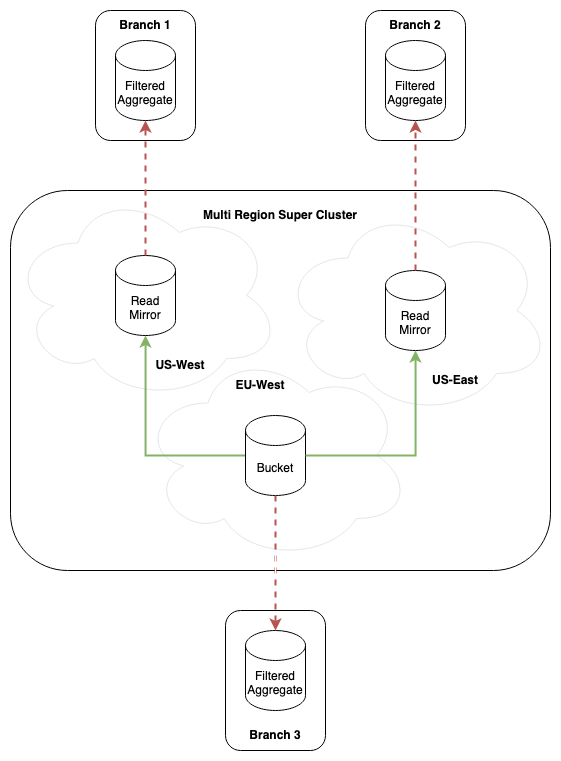

# JetStream based Key-Value Stores

| Metadata | Value                       |
|----------|-----------------------------|
| Date     | 2021-06-30                  |
| Author   | @ripienaar                  |
| Status   | Implemented                 |
| Tags     | jetstream, client, kv, spec |

## Release History

| Revision | Date       | Description                                         |
|----------|------------|-----------------------------------------------------|
| 1        | 2021-12-15 | Initial stable release of version 1.0 specification |
| 2        | 2023-10-16 | Document NATS Server 2.10 sourced buckets           |
| 2        | 2023-10-16 | Document read replica mirrors buckets               |
| 2        | 2023-10-16 | Document consistency guarantees                     |
| 3        | 2023-10-19 | Formalize initial bucket topologies                 |
| 4        | 2023-10-25 | Support compression                                 |
| 5        | 2024-06-05 | Add KV management                                   |
| 6        | 2024-06-05 | Add Keys listers with filters                       |


## Context

This document describes a design and initial implementation of a JetStream backed key-value store. All tier-1 clients
support KV.

## Status and Roadmap

The API is now stable and considered version 1.0, we have several NATS maintained client libraries with this feature supported
and a few community efforts are under way.

A roadmap is included below, but note this is subject to change. The API as is will not have breaking changes until 2.0, but
additional behaviors will come during the 1.x cycle.

### 1.0

 * Multiple named buckets hosting a hierarchy of keys with n historical values kept per key. History set per bucket and capped at 64.
 * Put and Get of `string(k)=[]byte(v)` values
 * Put only if the revision of the last value for a key matches an expected revision
 * Put only if the key does not currently exist, or if when the latest historical operation is a delete operation.
 * Key deletes preserves history
 * Keys can be expired from the bucket based on a TTL, TTL is set for the entire bucket
 * Watching a specific key, ranges based on NATS wildcards, or the entire bucket for live updates
 * Read-after-write safety
 * Valid keys are `\A[-/_=\.a-zA-Z0-9]+\z`, additionally they may not start or end in `.`
 * Valid buckets are `\A[a-zA-Z0-9_-]+\z`
 * Custom Stream Names and Stream ingest subjects to cater for different domains, mirrors and imports
 * Key starting with `_kv` is reserved for internal use
 * CLI tool to manage the system as part of `nats`, compatible with client implementations
 * Accept arbitrary application prefixes, as outlined in [ADR-19](https://github.com/nats-io/nats-architecture-and-design/blob/main/adr/ADR-19.md)
 * Data Compression for NATS Server 2.10

### 1.1

 * Merged buckets using NATS Server 2.10 subject transforms
 * Read replicas facilitated by Stream Mirrors
 * Replica auto discovery for mirror based replicas
 * Formalized Multi-cluster and Leafnode Topologies

### 1.2

 * Read-only operation mode
 * Read cache against with replica support
 * Ranged operations
 * Encoders and Decoders for keys and values
 * Additional Operation that indicates server limits management deleted messages

### 1.3

 * Standard Codecs that support zero-trust data storage with language interop

### 2.0

 * Formalise leader election against keys
 * Set management against key ranges to enable service discovery and membership management
 * Per value TTLs
 * Distributed locks against a key
 * Pluggable storage backends

## Data Types

Here's rough guidance, for some clients in some places you might not want to use `[]string` but an iterator, that's
fine, the languages should make appropriate choices based on this rough outline.

### Entry

This is the value and associated metadata made available over watchers, `Get()` etc. All backends must return an implementation providing at least this information.

```go
type Entry interface {
	// Bucket is the bucket the data was loaded from
	Bucket() string
	// Key is the key that was retrieved
	Key() string
	// Value is the retrieved value
	Value() []byte
	// Created is the time the data was received in the bucket
	Created() time.Time
	// Revision is a unique sequence for this value
	Revision() uint64
	// Delta is distance from the latest value. If history is enabled this is effectively the index of the historical value, 0 for latest, 1 for most recent etc.
	Delta() uint64
	// Operation is the kind of operation this entry represents, enum of PUT, DEL or PURGE
	Operation() Operation
}
```

### Status

This is the status of the KV as a whole

```go
type Status interface {
	// Bucket the name of the bucket
	Bucket() string

	// Values is how many messages are in the bucket, including historical values
	Values() uint64

	// History returns the configured history kept per key
	History() uint64

	// TTL is how long the bucket keeps values for
	TTL() time.Duration

	// Keys return a list of all keys in the bucket.
	// Historically this method returned a complete slice of all keys in the bucket,
	// however clients should return interable result.
	Keys() ([]string, error)

	// KeysWithFilters returns a filtered list of keys in the bucket.
	// Historically this method returned a complete slice of all keys in the bucket,
	// however clients should return interable result.
    // Languages can implement the list of filters in most idiomatic way - as an iterator, variadic argument, slice, etc.
    // When multiple filters are passed, client library should check `consumer info` from `consumer create method` if the filters are matching,
    // as nats-server < 2.10 would ignore them.
	KeysWithFilters(filter []string) ([]string, error)

	// IsCompressed indicates if the data is compressed on disk
	IsCompressed() bool

	// BackingStore is a name indicating the kind of backend
	BackingStore() string

    // Bytes returns the size in bytes of the bucket
    Bytes() uint64
}
```

The `BackingStore` describes the type of backend and for now returns `JetStream` for this implementation.

Languages can choose to expose additional information about the bucket along with this interface, in the Go implementation
the `Status` interface is above but the `JetStream` specific implementation can be cast to gain access to `StreamInfo()`
for full access to JetStream state.

The choice of `IsCompressed()` as a method name is idiomatic for Go, language maintainers can make a similar idiomatic
choice.

Other languages do not have a clear 1:1 match of the above idea so maintainers are free to do something idiomatic.

## RoKV

**NOTE:** Out of scope for version 1.0

This is a read-only KV store handle, I call this out here to demonstrate that we need to be sure to support a read-only
variant of the client. One that will only function against a read replica and cannot support `Put()` etc.

That capability is important, how you implement this in your language is your choice. You can throw exceptions on `Put()`
when read-only or whatever you like.

The interface here is a guide of what should function in read-only mode.

```go
// RoKV is a read-only interface to a single key-value store bucket
type RoKV interface {
	// Get gets a key from the store
	Get(key string) (Entry, error)

	// History retrieves historic values for a key
	History(ctx context.Context, key string) ([]Entry, error)

	// Watch a key(s) for updates, the same Entry might be delivered more than once. Key can be a specific key, a NATS wildcard
	// or an empty string to watch the entire bucket
	Watch(ctx context.Context, keySpec string) (Watch, error)

	// Keys retrieves a list of all known keys in the bucket
	Keys(ctx context.Context) ([]string, error)

	// Close releases in-memory resources held by the KV, called automatically if the context used to create it is canceled
	Close() error

	// Status retrieves the status of the bucket
	Status() (Status, error)
}
```

Regarding `Keys`, optionally the client can provide a method that provides the keys in an iterable or consumable form.

## KV

This is the read-write KV store handle, every backend should implement a language equivalent interface. But note the comments
by `RoKV` for why I call these out separately.

```go
// KV is a read-write interface to a single key-value store bucket
type KV interface {
	// Put saves a value into a key
	Put(key string, val []byte, opts ...PutOption) (revision uint64, err error)

	// Create is a variant of Put that only succeeds when the key does not exist if last historic event is a delete or purge operation
	Create(key string, val []byte) (revision uint64, err error)

	// Update is a variant of Put that only succeeds when the most recent operation on a key has the expected revision
	Update(key string, value []byte, last uint64) (revision uint64, err error)

	// Delete purges the key in a way that preserves history subject to the bucket history setting limits
	Delete(key string) error

	// Purge removes all data for a key including history, leaving 1 historical entry being the purge
	Purge(key string) error

	// Destroy removes the entire bucket and all data, KV cannot be used after
	Destroy() error

	RoKV
}
```

## KV Management

This is set of operations on the KV buckets from the JetStream context.

```go
// KeyValueManager is used to manage KeyValue buckets. It provides methods to
// create, delete, and retrieve.
type KeyValueManager interface {
    // KeyValue will lookup and bind to an existing KeyValue bucket.
    // Name can be `get_key_value`, or whatever name is idiomatic in given language.
    KeyValue(ctx context.Context, bucket string) (KeyValue, error)

    // CreateKeyValue will create a KeyValue bucket with the given
    // configuration.
    CreateKeyValue(ctx context.Context, cfg KeyValueConfig) (KeyValue, error)

    // UpdateKeyValue will update an existing KeyValue bucket with the given
    // configuration.
    UpdateKeyValue(ctx context.Context, cfg KeyValueConfig) (KeyValue, error)

    // CreateOrUpdateKeyValue will create a KeyValue bucket if it does not
    // exist or update an existing KeyValue bucket with the given
    // configuration (if possible).
    CreateOrUpdateKeyValue(ctx context.Context, cfg KeyValueConfig) (KeyValue, error)

    // DeleteKeyValue will delete given KeyValue bucket.
    DeleteKeyValue(ctx context.Context, bucket string) error

    // KeyValueBucketNames is used to retrieve a list of key value bucket
    // names. The KeyValueNamesLister should behave in a similar fashion
	// to the language implementation of Get Stream Names. If not already some sort of iterable,
    // an iterable form of the api is acceptable as well.
    KeyValueBucketNames(ctx context.Context) KeyValueNamesLister

    // KeyValueBuckets is used to retrieve a list of key value bucket
    // statuses. The KeyValueNamesLister should behave in a similar fashion
    // to the language implementation of Get Stream Infos. If not already some sort of iterable,
    // an iterable form of the api is acceptable as well.
    KeyValueBuckets(ctx context.Context) KeyValueStatusLister
}
```

## Storage Backends

We do have plans to support, and provide, commercial KV as part of our NGS offering, however there will be value in an
open source KV implementation that can operate outside of NGS, especially one with an identical API.

Today we will support a JetStream backend as documented here, future backends will have to be able to provide these
features, that is, this is the minimal feature set we can expect from any KV backend.

Client developers should keep this in mind while developing the library to at least not make it impossible to support
later.

### JetStream interactions

The features to support KV is in NATS Server 2.6.0.

#### Consistency Guarantees

By default, we do not provide read-after-write consistency.  Reads are performed directly to any replica, including out
of date ones.  If those replicas do not catch up multiple reads of the same key can give different values between
reads. If the cluster is healthy and performing well most reads would result in consistent values, but this should not
be relied on to be true.

If `allow_direct` is disabled on a bucket configuration read-after-write consistency is achieved at the expense of
performance.  It is then also not possible to use the mirror based read replicas.

#### Buckets

A bucket is a Stream with these properties:

 * The main write bucket must be called `KV_<Bucket Name>`
 * The 'ingest' subjects must be `$KV.<Bucket Name>.>`
 * The bucket history or 'max history per key' is achieved by setting `max_msgs_per_subject` to the desired history level.
   * The maximum allowed size is 64.
   * The minimum allowed size is 1. When creating a stream, 1 should be used when the user does not supply a value.
 * Safe key purges that deletes history requires rollup to be enabled for the stream using `rollup_hdrs`
 * Write replicas are File backed and can have a varying R value
 * Key TTL is managed using the `max_age` key
 * Duplicate window must be same as `max_age` when `max_age` is less than 2 minutes
 * Maximum value sizes can be capped using `max_msg_size`
 * Maximum number of keys cannot currently be limited
 * Overall bucket size can be limited using `max_bytes`
 * Discard Policy is always set to `new`
 * Rollup Headers is always set to `true`
 * Deny Delete is always set to `true`
 * Allow Direct is always set to `true`. (It can be modified out-of-band only if desired, but not through KV bucket update.)
 * Placement is allowed
 * Republish is allowed
 * If compression is requested in the configuration set `compression` to `s2`

Here is a full example of the `CONFIGURATION` bucket with compression enabled:

```json
{
  "name": "KV_CONFIGURATION",
  "subjects": [
    "$KV.CONFIGURATION.>"
  ],
  "retention": "limits",
  "max_consumers": -1,
  "max_msgs_per_subject": 5,
  "max_msgs": -1,
  "max_bytes": -1,
  "max_age": 0,
  "max_msg_size": -1,
  "storage": "file",
  "discard": "new",
  "num_replicas": 1,
  "duplicate_window": 120000000000,
  "rollup_hdrs": true,
  "deny_delete": true,
  "allow_direct": true,
  "compression": "s2",
  "placement": {
    "cluster": "clstr",
    "tags": ["tag1", "tag2"]
  },
  "republish": {
    "src": "repub.>",
    "dest": "dest.>",
    "headers_only": true
  }
}
```

#### Storing Values

Writing a key to the bucket is a basic JetStream request.

The KV key `auth.username` in the `CONFIGURATION` bucket is written sent, using a request, to `$KV.CONFIGURATION.auth.username`.

To implement the feature that would accept a write only if the revision of the current value of a key has a specific revision
we use the new `Nats-Expected-Last-Subject-Sequence` header. The special value `0` for this header would indicate that the message
should only be accepted if it's the first message on a subject. This is purge aware, ie. if a value is in and the subject is purged
again a `0` value will be accepted.

This can be implemented as a `PutOption` ie. `Put("x.y", val, UpdatesRevision(10))`, `Put("x.y", val, MustCreate())` or
by adding the `Create()` and `Update()` helpers, or both. Other options might be `UpdatesEntry(e)`, language implementations
can add what makes sense in addition.

To use this header correctly with KV when a value of `0` is given, on failure that indicates it's not the first message we
should attempt to load the current value and if that's a delete do an update with `Nats-Expected-Last-Subject-Sequence` equalling
to the value of the deleted message that was retrieved.

#### Retrieving Values

There are different situations where messages will be retrieved using different APIs, below describes the different models.

In all cases we return a generic `Entry` type.

Deleted data - (see later section on deletes) - has the `KV-Operation` header set to `DEL` or `PURGE`, really any value other than unset
- a value received from either of these methods with this header set indicates the data has been deleted. A delete operation is turned
into a `key not found` error in basic gets and into a `Entry` with the correct operation value set in watchers or history.

##### Get Operation

###### When allow_direct is false

We have extended the `io.nats.jetstream.api.v1.stream_msg_get_request` API to support loading the latest value for a specific
subject.  Thus, a read for `$KV.CONFIGURATION.username` becomes a `io.nats.jetstream.api.v1.stream_msg_get_request`
with the `last_by_subj` set to `$KV.CONFIGURATION.auth.username`.

###### When allow_direct is true

We have introduced a new direct API that allows retrieving the last message for a subject via `$JS.APIDIRECT.GET.
<STREAM>.<SUBJECT>`. This should be used for performing all gets on a bucket if direct is enabled.

##### History

These operations require access to all values for a key, to achieve this we create an ephemeral consumer on filtered by the subject
and read the entire value list in using `deliver_all`. Use an Ordered Consumer to do this efficiently.

JetStream will report the Pending count for each message, the latest value from the available history would have a pending of `0`.
When constructing historic values, dumping all values etc we ensure to only return pending 0 messages as the final value

##### Watch

A watch, like History, is based on ephemeral consumers reading values using Ordered Consumers, but now we start with the new
`last_per_subject` initial start, this means we will get all matching latest values for all keys.

Watch can take options to allow including history, sending only new updates or sending headers only. Using a Watch end users
should be able to implement at minimum history retrieval, data dumping, key traversal or updates notification behaviors.

#### Deleting Values

Since the store support history - via the `max_age` for messages - we should preserve history when deleting keys. To do this we
place a new message in the subject for the key with a nil body and the header `KV-Operation: DEL`.

This preserves history and communicate to watchers, caches and gets that a delete operation should be handled - clear cache,
return no key error etc.

#### Purging a key

Purge is like delete but history is not preserved. This is achieved by publishing a message in the same manner as Delete using the
`KV-Operation: PURGE` header but adding the header `Nats-Rollup: sub` in addition.

This will instruct the server to place the purge operation message in the stream and then delete all messages for that key up to
before the delete operation.

#### List of known keys

Keys return a list of all keys defined in the bucket, this is done using a headers-only Consumer set to deliver last per subject.

Any received messages that isn't a Delete/Purge operation gets added to the list based on parsing the subject.

#### Deleting a bucket

Remove the stream entirely.

#### Watchers Implementation Detail

Watchers support sending received `PUT`, `DEL` and `PURGE` operations across a channel or language specific equivalent.

Watchers support accepting simple keys or ranges, for example watching on `auth.username` will get just operations on that key,
but watching `auth.>` will get operations for everything below `auth.`, the entire bucket can be watched using an empty key or a
key with wildcard `>`.

We need to signal when we reach the end of the initial data set to facilitate use cases such as dumping a bucket, iterating keys etc.
Languages can implement an End Of Initial Data signal in a language idiomatic manner. Internal to the watcher you reach this state the
first time any message has a `Pending==0`. This signal must also be sent if no data is present - either by checking for messages using
`GetLastMsg()` on the watcher range or by inspecting the Pending+Delivered after creating the consumer. The signal must always be sent.

Whatchers should support at least the following options. Languages can choose to support more models if they wish, as long as that
is clearly indicated as a language specific extension. Names should be language idiomatic but close to these below.

| Name             | Description                                                                                                                                |
|------------------|--------------------------------------------------------------------------------------------------------------------------------------------|
| `IncludeHistory` | Send all available history rather than just the latest entries                                                                             |
| `IgnoreDeletes`  | Only sends `PUT` operation entries                                                                                                         |
| `MetaOnly`       | Does not send any values, only metadata about those values                                                                                 |
| `UpdatesOnly`    | Only sends new updates made, no current or historical values are sent. The End Of Initial Data marker is sent as soon as the watch starts. |

The default behavior with no options set is to send all the `last_per_subject` values, including delete/purge operations.

#### Multi-Cluster and Leafnode topologies

A bucket, being backed by a Stream, lives in one Cluster only. To make buckets available elsewhere we have to use
JetStream Sources and Mirrors.

In KV we call these `Toplogies` and adding *Topology Buckets* require using different APIs than the main Bucket API
allowing us to codify patterns and options that we support at a higher level than the underlying Stream options.

For example, we want to be able to expose a single boolean that says an Aggregate is read-only which would potentially
influence numerous options in the Stream Configuration.



To better communicate the intent than the word Source we will use `Aggregate` in KV terms:

 **Mirror**: Copy of exactly 1 other bucket. Used primarily for scaling out the `Get()` operations.

 * It is always Read-Only
 * It can hold a filtered subset of keys
 * Replicas are automatically picked using a RTT-nearest algorithm without any configuration
 * Additional replicas can be added and removed at run-time without any re-configuration of already running KV clients
 * Writes and Watchers are transparently sent to the origin bucket
 * Can replicate buckets from other accounts and domains

**Aggregate**: A `Source` that combines one or many buckets into 1 new bucket. Used to provide a full local copy of
other buckets that support watchers and gets locally in edge scenarios.

 * Requires being accessed specifically by its name used in a `KeyValue()` call
 * Can be read-only or read-write
 * It can hold a subset of keys from the origin buckets to limit data exposure or size
 * Can host watchers
 * Writes are not transparently sent to the origin Bucket as with Replicas, they either fail (default) or succeed and
   modify the Aggregate (opt-in)
 * Can combine buckets from multiple other accounts and domains into a single Aggregate
 * Additional Sources can be added after initially creating the Aggregate

Experiments:

These items we will add in future iterations of the Topology concept:

 * Existing Sources can be removed from an Aggregate. Optionally, but by default, purge the data out of the bucket
   for the Source being removed
 * Watchers could be supported against a Replica and would support auto-discovery of nearest replica but would
  minimise the ability to add and remove Replicas at runtime

*Implementation Note*: While this says Domains are supported, we might decide not to implement support for them at
this point as we know we will revisit the concept of a domain. The existing domain based mirrors that are supported
in KeyValueConfig will be deprecated but supported for the foreseeable future for those requiring domain support.

#### Creation of Aggregates

Since NATS Server 2.10 we support transforming messages as a stream configuration item. This allows us to source one
bucket from another and rewrite the keys in the new bucket to have the correct name.

We will model this using a few API functions and specific structures:

```go
// KVAggregateConfig configures an aggregate
//
// This one is quite complex because are buckets in their own right and so inevitably need
// to have all the options that are in buckets today (minus the deprecated ones).
type KVAggregateConfig struct {
    Bucket       string
    Writable     bool
    Description  string
    Replicas     int
    MaxValueSize int32
    History      uint8
    TTL          time.Duration
    MaxBytes     int64
    Storage      KVStorageType // a new kv specific storage struct, for now identical to normal one
    Placement    *KVPlacement // a new kv specific placement struct, for now identical to normal one
    RePublish    *KVRePublish // a new kv specific replacement struct, for now identical to normal one
    Origins      []*KVAggregateOrigin
}

type KVAggregateOrigin struct {
    Stream   string   // note this is Stream and not Bucket since the origin may be a mirror which may not be a bucket
    Bucket   string   // in the case where we are aggregating from a mirror, we need to know the bucket name to construct mappings
    Keys     []string // optional filter defaults to >
    External *ExternalStream
}

// CreateAggregate creates a new read-only Aggregate bucket with one or more sources
CreateAggregate(ctx context.Context, cfg KVAggregateOrigin) (KeyValue, error) {}

// AddAggregateOrigin updates bucket by adding new origin cfg, errors if bucket is not an Aggregate
AddAggregateOrigin(ctx context.Context, bucket KeyValue, cfg KVAggregateOrigin) error {}
```

To copy the keys `NEW.>` from bucket `ORDERS` into `NEW_ORDERS`:

```go
bucket, _ := CreateAggregate(ctx, KVAggregateConfig{
    Name: "NEW_ORDERS",
    Writable: false,
    Origins: []KVAggregateOrigin{
        {
            Stream: "KV_ORDERS",
            Keys: []string{"NEW.>"}
        }
    }
})
```

We create the new stream with the following partial config, rest as per any other KV, if the `orders` handle :

```json
    "subjects": []string{},
    "deny_delete": true,
    "deny_purge": true,
    "sources": [
      {
        "name": "KV_ORDERS",
        "subject_transforms": [
          {
            "src": "$KV.ORDERS.NEW.>",
            "dest": "$KV.NEW_ORDERS.>"
          }
        ]
      }
    ],
```

When writable, configure as normal just add the sources.

This results in all messages from `ORDERS` keys `NEW.>` to be copied into `NEW_ORDERS` and the subjects rewritten on
write to the new bucket so that a unmodified KV client on `NEW_ORDERS` would just work.

#### Creation of Mirrors

Replicas can be built using the standard mirror feature by setting `mirror_direct` to true as long as the origin bucket
also has `allow_direct`. When adding a mirror it should be confirmed that the origin bucket has `allow_direct` set.

We will model this using a few API functions and specific structures:

```go
type KVMirrorConfig struct {
    Name         string // name, not bucket, as this may not be accessed as a bucket
    Description  string
    Replicas     int
    History      uint8
    TTL          time.Duration
    MaxBytes     int64
    Storage      StorageType
    Placement    *Placement

    Keys         []string // mirrors only subsets of keys
    OriginBucket string
    External     *External
}

// CreateMirror creates a new read-only Mirror bucket from an origin bucket
CreateMirror(ctx context.Context, cfg KVMirrorConfig)  error {}
```

These mirrors are not called `Bucket` and may not have the `KV_` string name prefix as they are not buckets and cannot
be used as buckets without significant changes in how a KV client constructs its key names etc, we have done this in
the leafnode mode and decided it's not a good pattern.

When creating a replica of `ORDERS` to `MIRROR_ORDERS_NYC` we do:

```go
err := CreateMirror(ctx, origin, KVMirrorConfig{
    Name: "MIRROR_ORDERS_NYC",
    // ...
    OriginStream: "ORDERS"
})
```

When a direct read is done the response will be from the rtt-nearest mirror.  With a mirror added the `nats` command
can be used to verify that a alternative location is set:

```
$ nats s info KV_ORDERS
...
State:

            Alternates: MIRROR_ORDERS_NYC: Cluster: nyc Domain: hub
                                KV_ORDERS: Cluster: lon Domain: hub

```

Here we see a RTT-sorted list of alternatives, the `MIRROR_ORDERS_NYC` is nearest to me in the RTT sorted list.

When doing a direct get the headers will confirm the mirror served the request:

```
$ nats req '$JS.API.DIRECT.GET.KV_ORDERS.$KV.ORDERS.NEW.123' ''
13:26:06 Sending request on "JS.API.DIRECT.GET.KV_ORDERS.$KV.ORDERS.NEW.123"
13:26:06 Received with rtt 1.319085ms
13:26:06 Nats-Stream: MIRROR_ORDERS_NYC
13:26:06 Nats-Subject: $KV.ORDERS.NEW.123
13:26:06 Nats-Sequence: 12
13:26:06 Nats-Time-Stamp: 2023-10-16T12:54:19.409051084Z

{......}
```

As mirrors support subject filters these replicas can hold region specific keys.

As this is a `Mirror` this stream does not listen on a subject and so the only way to get data into it is via the origin
bucket.  We should also set the options to deny deletes and purges.

#### API Design notes

The API here represents a minimum, languages can add local flavour to the API - for example one can add `PutUint64()` and `GetUint64()`
in addition to the `Get()` and `Put()` defined here, but it's important that as far as possible all implementations strive to match
the core API calls - `Get()`, `Put()` and to a lesser extent `Delete()` and `Purge()` and `Entry` - the rest, admin APIs, and supporting
calls can be adjusted to be a natural fit in the language and design.  This is in line with existing efforts to harmonize
`Subscribe()`, `Publish()` and more.

The design is based on extensive prior art in the industry. During development 20+ libraries in Go, Ruby, Python and Java were reviewed
for their design choices and this influenced things like `Get()` returning an `Entry`.

Consul Go:

```go
func (k *KV) Put(p *KVPair, q *WriteOptions) (*WriteMeta, error){}
func (k *KV) Get(key string, q *QueryOptions) (*KVPair, *QueryMeta, error)
```

Here KVPair has properties like `Key`, various revision, flags, timestamps etc and `Value []byte`.

Dynanic language libraries like Python for example return maps, but there too the return value of a default `get()` operation is a hash
with all metadata and value stored in `Value` or similar.

Various Java libraries from the Consul site were reviewed, there's a mixed bag but most seem to settle on `getXXX() with `getValue()` being
a common function name  and it returns a fat value object with lots of metadata. [Ecwid/consul-api](https://github.com/Ecwid/consul-api) is a good example.

etcd Go:

```go
func Put(ctx context.Context, key, val string, opts ...OpOption) (*PutResponse, error) {}
func Get(ctx context.Context, key string, opts ...OpOption) (*GetResponse, error) {}
```

Here `GetResponse` is much fatter than we propose as it also supports ranged queries and so multiple values, each being like our Entry.

The official `jetcd` library has a `get()` that returns a future and an equally fat ranged response.

Various Ruby etcd clients were reviewed, same design around `get` with a object returned.

So the overall consensus is that a `Entry` like entity should be returned, hard to say but indeed `Get(string) ([]byte,error)` would seem
like a good default design, but in the face of massive evidence that this is just not the chosen design I picked returning a `Entry` as
the default behavior.  But leaving it open to languages to add additional helpers.

Given that `get()` as a name isn't impossible in Java - see etcd for example - I think in the interest of harmonized client design we should
use `get()` wherever possible augmented by other get helpers.

Regarding `Put`, these other APIs do not tend to add other functions like `Create()` or `Update()`, they accept put options, like we do.
Cases where they want to build for example a CAS wrapper around their KV they will write a wrapper with CAS specific function names and more,
ditto for service registeries and so forth.

On the name `Entry` for the returned result. `Value` seemed a bit generic and I didn't want to confuse matters mainly in the go client
that has the unfortunate design of just shoving everything and the kitchen sink into a single package. `KVValue` is a stutter and so
settled on `Entry`.
